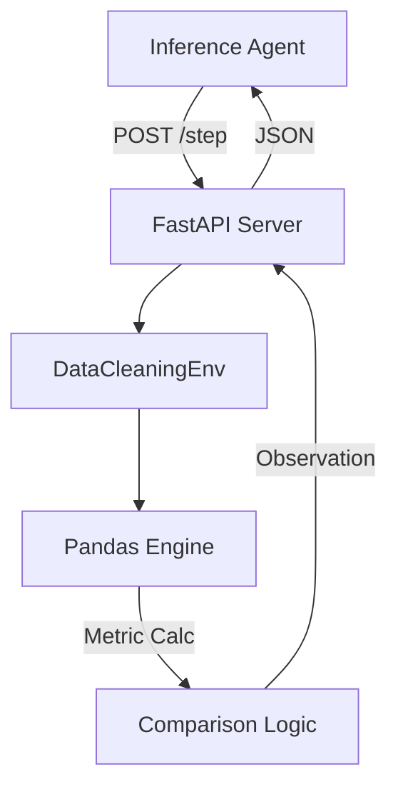

# 🧹 OpenEnv: Tabular Data Cleaner

[](https://huggingface.co/spaces/CodyRohith7/OpenEnv-Tabular-cleaning)
[](https://www.python.org/downloads/)
[](https://opensource.org/licenses/MIT)

A high-performance, deterministic OpenEnv environment designed for the **Meta PyTorch Hackathon 2026**. This environment simulates real-world data engineering tasks where an AI agent must iteratively clean, standardize, and aggregate raw tabular data to match a hidden ground-truth requirement.

## 🌟 Key Features
- **Deterministic Evaluation**: Every action has a measurable impact on cell-level accuracy and schema structure.
- **Three-Tiered Challenge**: Progressive difficulty from simple normalization to complex data engineering (Grouping/Currency/Date Parsing).
- **Agent-Agnostic API**: strictly follows the OpenEnv specification for seamless integration with GPT-4, Claude, or local LLMs.

## 🚀 Deployment & Usage

- **Hugging Face Space**: [Live Demo](https://huggingface.co/spaces/CodyRohith7/OpenEnv-Tabular-cleaning)
- **API Endpoint**: `https://codyrohith7-openenv-tabular-cleaning.hf.space`

### 🛠️ Local Development
1. **Clone & Setup**
   ```bash
   git clone https://github.com/CodyRohith7/OpenEnv_Tabular_DataCleaner
   cd OpenEnv_Tabular_DataCleaner
   pip install -r requirements.txt
   ```
2. **Launch Server**
   ```bash
   uvicorn server.main:app --host 0.0.0.0 --port 7860
   ```

## 🤖 Baseline Evaluation
To benchmark the environment, we provide a sophisticated baseline agent in `inference.py`.

```bash
# Set your OpenAI Key
export OPENAI_API_KEY="sk-..."
# Run the evaluation loop
python inference.py
```

### Evaluation Metric (`Reward Logic`)
The environment rewards agents based on:
1. **Cell Accuracy (40%)**: Literal match with the gold dataset.
2. **Schema Correctness (30%)**: Target column existence and naming.
3. **Deduplication F1 (30%)**: Proper handling of redundant records.

## 🏗️ Technical Architecture


---
Built with ❤️ for the **Meta PyTorch Hackathon 2026**.
