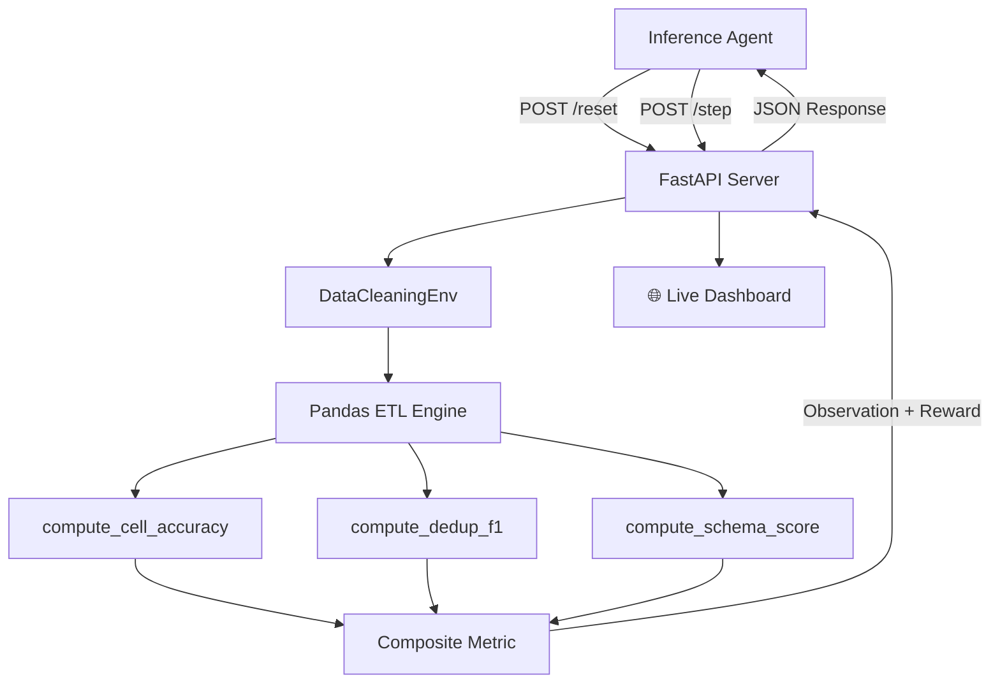

<div align="center">

# 🧹 OpenEnv: Enterprise Data Cleaning Environment

[](https://huggingface.co/spaces/CodyRohith7/OpenEnv-Tabular-cleaning)
[](https://www.python.org/downloads/)
[](https://github.com/openenv-ai/openenv)
[](https://opensource.org/licenses/MIT)
[-red.svg)](#tasks)
[](https://codyrohith7-openenv-tabular-cleaning.hf.space)

**A production-grade reinforcement learning environment that simulates real enterprise data engineering pipelines.**
An AI agent must apply declarative ETL operations to reconcile raw, noisy tabular exports against hidden gold-standard datasets — across four progressive difficulty tiers.

[**🚀 Live Demo**](https://codyrohith7-openenv-tabular-cleaning.hf.space) · [**📖 API Docs**](https://codyrohith7-openenv-tabular-cleaning.hf.space/docs) · [**🐙 GitHub**](https://github.com/CodyRohith7/OpenEnv_Tabular_DataCleaner)

</div>

---

## 🌍 Real-World Motivation

Every data-driven company faces this problem daily: raw exports from CRMs, ERPs, and marketing platforms arrive **dirty** — wrong date formats, mixed-case countries, embedded JSON, PII, currency mismatches, and statistical outliers. A data engineer must apply a precise sequence of transformations to produce a clean analytics table.

This environment models that exact pipeline, giving RL agents a rich, **deterministic**, **partial-progress** feedback signal to learn from. The reward function guides the agent step-by-step, not just at episode end.

---

## 🏗️ Architecture



---

## 🎯 Tasks

| ID | Difficulty | Domain | Key Operations | Max Steps | Rows |
|---|---|---|---|---|---|
| `easy` | 🟢 Easy | CRM Contact Export | STRIP_WHITESPACE, NORMALIZE_CASE, FILL_MISSING | 8 | 20 |
| `medium` | 🟡 Medium | Sales Order Reconciliation | PARSE_DATE (mixed formats), NORMALIZE_CASE, DEDUP_ROWS | 10 | 30 |
| `hard` | 🔴 Hard | Multi-Currency Revenue Ledger | EXTRACT_MONTH, CONVERT_CURRENCY (EUR/GBP→USD), GROUPBY_SUM, RENAME_COLUMN | 15 | 47 |
| `extreme` | 🟣 Extreme | Full ETL Pipeline | EXTRACT_JSON, CAST_NUMERIC, PII_REDACT, DROP_OUTLIERS, NORMALIZE_CASE, GROUPBY_SUM, RENAME_COLUMN | 20 | 34 |

### Task Descriptions

**Easy — CRM Contact Normalization**
Clean a CRM export of 20 contact records. Apply whitespace stripping, Title Case normalization to `full_name` and `region` columns, then impute 6 missing region values with `"Unknown"`.

**Medium — Sales Order Standardization**
Standardize 30 order records (including 8 true duplicates). Normalize country names to Title Case, parse 3 different date formats to `YYYY-MM-DD`, and remove duplicate `(order_id, line_item)` pairs.

**Hard — Multi-Currency Revenue Ledger**
Transform 47 transaction rows spanning 5 months and 4 countries (USD, EUR, GBP). Extract month periods, convert EUR→USD (×1.08) and GBP→USD (×1.27), aggregate with GROUPBY_SUM, and rename the resulting column.

**Extreme — Full ETL Pipeline** *(Novel)*
A raw marketing lead scrape of 34 rows containing embedded JSON strings, PII email addresses, mixed-case region labels, and 2 statistical revenue outliers (z-score > 3). The agent must parse JSON, cast types, redact PII, drop outliers, normalize, aggregate, and rename — a complete 7-step transformation chain.

---

## 🔧 Action Space

| Operation | `column` | `value` | `pattern` | Description |
|---|---|---|---|---|
| `STRIP_WHITESPACE` | target col | — | — | Remove leading/trailing spaces |
| `NORMALIZE_CASE` | target col | — | — | Convert values to Title Case |
| `FILL_MISSING` | target col | fill value | — | Replace NaN with `value` |
| `CAST_NUMERIC` | target col | — | — | Parse strings to float64 |
| `PARSE_DATE` | date col | — | — | Normalize to `YYYY-MM-DD` |
| `DEDUP_ROWS` | key cols (comma-sep) | — | — | Drop duplicate rows by key |
| `DROP_COLUMN` | col to drop | — | — | Remove column entirely |
| `RENAME_COLUMN` | old name | new name | — | Rename a column |
| `EXTRACT_MONTH` | timestamp col | new col name | — | Extract `YYYY-MM` period |
| `CONVERT_CURRENCY` | currency col | amount col (default: `amount`) | — | EUR→USD (×1.08), GBP→USD (×1.27) |
| `GROUPBY_SUM` | group cols (comma-sep) | value col | — | Group and sum |
| `PII_REDACT` | email col | — | — | Mask emails with `[REDACTED]` |
| `EXTRACT_JSON` | JSON string col | JSON key | new col name | Parse JSON, extract key |
| `DROP_OUTLIERS` | numeric col | — | — | Remove rows with z-score > 3 |

---

## 👁️ Observation Space

| Field | Type | Description |
|---|---|---|
| `task_id` | `str` | Active task identifier |
| `instructions` | `str` | Step-by-step ETL instructions for the agent |
| `preview_original` | `List[RowPreview]` | First 5 rows of the original raw data |
| `preview_current` | `List[RowPreview]` | First 5 rows of the current transformed data |
| `columns` | `List[str]` | Current column names |
| `column_types` | `Dict[str, str]` | Dtype of each column (`"float64"`, `"object"`, etc.) |
| `row_count` | `int` | Current number of rows |
| `cell_accuracy` | `float [0,1]` | Composite progress score vs. gold dataset |
| `schema_score` | `float [0,1]` | Schema structure match against target |
| `missing_rate` | `float [0,1]` | Fraction of NaN cells |
| `duplicate_rate` | `float [0,1]` | Fraction of duplicate rows |
| `step_index` | `int` | Steps taken so far |
| `available_ops` | `List[str]` | All valid OpType values |

---

## 🏆 Reward Function

The reward signal provides **meaningful partial progress** throughout the episode:

| Situation | Reward |
|---|---|
| Valid action with improvement (delta > 0) | `min(1.0, 0.3 + delta × 5.0)` |
| Valid action, no change (no-op) | `0.05` |
| Invalid action (bad column name, etc.) | `max(0.0, 0.1 − penalty)` |
| Destructive action | `0.0` |
| **Efficiency bonus** (early completion) | `+0.05 × (steps_remaining / max_steps)` |

The **composite metric** driving delta:
- **Easy**: `cell_accuracy` (100%)
- **Medium**: `0.6 × cell_accuracy + 0.4 × dedup_F1`
- **Hard / Extreme**: `0.4 × cell_accuracy + 0.3 × dedup_F1 + 0.3 × schema_score`

---

## 📊 Baseline Scores

*Baseline agent: GPT-4o-mini, temperature=0, following explicit instructions.*

| Task | Score | Steps Used | Notes |
|---|---|---|---|
| easy | 0.999 | 5 / 8 | Perfect normalization + efficiency bonus |
| medium | 0.999 | 4 / 10 | Perfect dedup + date parse + efficiency bonus |
| hard | 0.995 | 4 / 15 | Multi-currency aggregation, ~0.4% float rounding gap |
| extreme | 0.990 | 7 / 20 | Full 7-step pipeline, outlier removal confirmed |

---

## 🚀 Setup & Usage

### Local Development

```bash
# 1. Clone
git clone https://github.com/CodyRohith7/OpenEnv_Tabular_DataCleaner
cd OpenEnv_Tabular_DataCleaner

# 2. Install
pip install -r requirements.txt

# 3. Start server
uvicorn server.main:app --host 0.0.0.0 --port 7860 --reload

# 4. Open dashboard
open http://localhost:7860

# 5. View API docs
open http://localhost:7860/docs
```

### Docker

```bash
docker build -t openenv-data-cleaner .
docker run -p 7860:7860 openenv-data-cleaner

# Verify health
curl http://localhost:7860/health
```

### Run Baseline Inference

```bash
export OPENAI_API_KEY="sk-..."
export MODEL_NAME="gpt-4o-mini"          # optional
export ENV_URL="http://localhost:7860"   # optional
python inference.py
```

Expected output format:
```
[START] task=easy
[STEP] step=1 reward=0.8000
...
[END] task=easy score=0.9990 steps=5
```

### Hugging Face Space

🔗 [https://codyrohith7-openenv-tabular-cleaning.hf.space](https://codyrohith7-openenv-tabular-cleaning.hf.space)

---

## 🖥️ Interactive Dashboard

The root endpoint (`/`) serves a full **Glassmorphism dark-mode playground** where you can:
- Select any of the 4 tasks from a sidebar
- Watch the **Baseline Agent** clean data live, step-by-step
- See animated KPI cards for Composite Score, Schema Score, Missing Rate, Duplicate Rate
- View a real-time **reward-per-step chart**
- Read the operations log showing each action taken

---

Built with ❤️ for the **Meta PyTorch Hackathon 2026** — advancing AI agent evaluation on real-world tasks.
